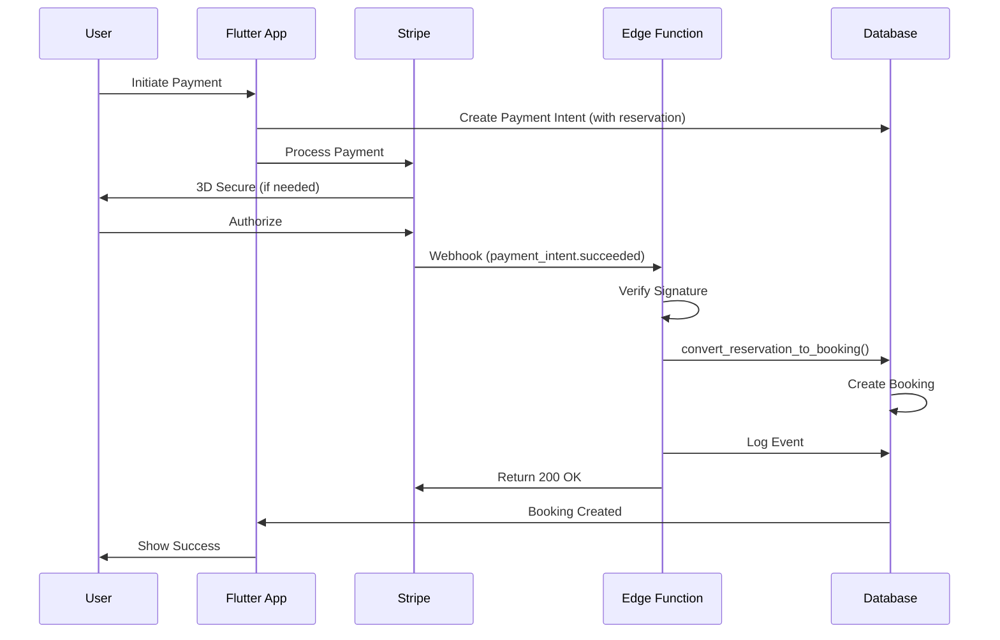

# DinnerHelp Webhook System Documentation

## Overview
DinnerHelp uses Stripe webhooks to handle payment processing and booking creation. This document explains the webhook architecture, configuration, and troubleshooting.

## Current Architecture (As of 2025-09-06)

### Webhook Flow
```
Stripe Payment Event 
    ↓
Edge Function (stripe-webhook)
    ↓
Verify Signature
    ↓
Process Payment
    ↓
Create Booking
    ↓
Send Notifications
```

## Edge Functions

### 1. `stripe-webhook` (RECOMMENDED - PRIMARY HANDLER)
- **Endpoint**: `https://[PROJECT_ID].supabase.co/functions/v1/stripe-webhook`
- **Purpose**: Main webhook handler for all Stripe events
- **Features**:
  - Signature verification for security
  - Handles payment intents (succeeded, failed, canceled)
  - Creates bookings from successful payments
  - Updates reservation status
  - Handles refunds
- **Configuration**: JWT verification disabled (uses Stripe signature instead)

### 2. `handle-stripe-webhook` (DEPRECATED)
- **Status**: Deprecated - will be removed
- **Purpose**: Older version of webhook handler
- **Note**: Do not use for new implementations

### 3. `stripe-webhook-db` (LOGGING ONLY)
- **Purpose**: Stores webhook events for audit trail
- **Note**: Does NOT process payments, only logs events

## Database Components

### Tables

#### `stripe_webhook_events`
Stores all webhook events for debugging and audit trail:
- `event_id`: Stripe event ID
- `type`: Event type (e.g., 'payment_intent.succeeded')
- `data`: Complete event payload
- `processed`: Whether event was processed
- `error`: Any error messages
- `created_at`: When event was received

#### `payment_intents`
Tracks payment intents and reservations:
- `stripe_payment_intent_id`: Stripe's payment intent ID
- `booking_data`: JSON data for creating booking
- `reservation_status`: Status of reservation (active/expired/converted)
- `status`: Payment status from Stripe

### Database Functions

#### `convert_reservation_to_booking`
Converts a payment reservation to an actual booking after successful payment.
- Called by Edge Function when payment succeeds
- Creates booking record from reservation data
- Updates reservation status to 'converted'

## Stripe Configuration

### Setting Up Webhooks in Stripe Dashboard

1. Go to Stripe Dashboard → Developers → Webhooks
2. Add endpoint: `https://[YOUR_PROJECT_ID].supabase.co/functions/v1/stripe-webhook`
3. Select events to listen for:
   - `payment_intent.succeeded` ✅ (Required)
   - `payment_intent.payment_failed` ✅ (Required)
   - `payment_intent.canceled` ✅ (Required)
   - `charge.refunded` (Optional - for refund handling)
4. Copy the webhook signing secret
5. Add to Supabase Edge Function secrets:
   - Name: `STRIPE_WEBHOOK_SECRET`
   - Value: `whsec_...` (from Stripe)

### Required Environment Variables

Edge Functions need these secrets:
- `STRIPE_SECRET_KEY`: Your Stripe secret key
- `STRIPE_WEBHOOK_SECRET`: Webhook signing secret from Stripe
- `SUPABASE_URL`: Auto-provided by Supabase
- `SUPABASE_SERVICE_ROLE_KEY`: Auto-provided by Supabase

## Deployment

### Deploy Edge Functions
```bash
# Deploy the main webhook handler
supabase functions deploy stripe-webhook --no-verify-jwt

# If you need to update config
supabase config push
```

### Testing Locally
```bash
# Use Stripe CLI for local testing
stripe listen --forward-to localhost:54321/functions/v1/stripe-webhook

# Trigger test events
stripe trigger payment_intent.succeeded
```

## Troubleshooting

### Common Issues

#### 1. "No active reservation found for payment intent"
**Cause**: Payment intent doesn't have reservation data
**Solution**: Ensure payment intent is created with booking_data

#### 2. Webhook signature verification failed
**Cause**: Wrong webhook secret or modified payload
**Solution**: Verify `STRIPE_WEBHOOK_SECRET` matches Stripe dashboard

#### 3. Booking not created after payment
**Cause**: Edge Function error or database issue
**Solution**: Check Edge Function logs in Supabase dashboard

### Debugging Tools

#### Monitor Webhooks
```sql
-- View recent webhook events
SELECT * FROM webhook_monitoring 
ORDER BY created_at DESC 
LIMIT 10;

-- Check failed events
SELECT * FROM stripe_webhook_events 
WHERE processed = false 
  AND error IS NOT NULL
ORDER BY created_at DESC;

-- Check payment intents
SELECT * FROM payment_intents 
WHERE created_at > NOW() - INTERVAL '1 hour'
ORDER BY created_at DESC;
```

#### Check Edge Function Logs
1. Go to Supabase Dashboard → Functions
2. Click on `stripe-webhook`
3. View logs for errors

## Migration History

### 2025-09-06: Webhook System Consolidation
- **Problem**: Multiple competing webhook handlers causing conflicts
  - Database trigger processing events
  - Multiple Edge Functions handling same events
  - Booking creation failing due to conflicts
  
- **Solution**: 
  - Disabled database trigger approach
  - Consolidated to single Edge Function (`stripe-webhook`)
  - Improved error handling and logging
  
- **Migration**: `fix_webhook_processing_system`

## Best Practices

1. **Always verify webhook signatures** - Never trust unsigned webhooks
2. **Return 200 quickly** - Acknowledge receipt within 20 seconds
3. **Process asynchronously** - Don't block on long operations
4. **Handle idempotency** - Same event might be delivered multiple times
5. **Log everything** - Store raw events for debugging
6. **Monitor regularly** - Check webhook_monitoring view daily

## Payment Flow Diagram



## Security Considerations

1. **Signature Verification**: Always verify Stripe signatures
2. **Service Role Key**: Only use in Edge Functions, never client-side
3. **No JWT for Webhooks**: Webhooks use Stripe signatures, not JWT
4. **Audit Trail**: All events logged in `stripe_webhook_events`
5. **Error Handling**: Never expose internal errors to external services

## Maintenance

### Regular Tasks
- Check `webhook_monitoring` view for failed events
- Review Edge Function logs weekly
- Update Stripe webhook endpoint if URL changes
- Test with Stripe CLI after major changes

### Cleanup
```sql
-- Clean old processed webhook events (keep 90 days)
DELETE FROM stripe_webhook_events 
WHERE created_at < NOW() - INTERVAL '90 days'
  AND processed = true;
```

## Contact

For issues with the webhook system:
1. Check this documentation first
2. Review Edge Function logs
3. Check `webhook_monitoring` view
4. Contact development team with event IDs

---

Last Updated: 2025-09-06
Version: 1.0